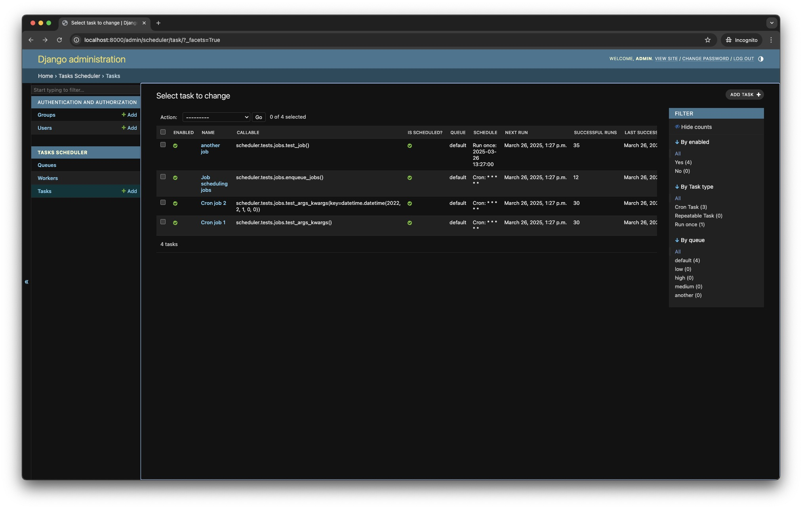

Django Tasks Scheduler
===================
[](https://github.com/django-commons/django-tasks-scheduler/actions/workflows/test.yml)

[](https://pypi.org/project/django-tasks-scheduler/)

Documentation can be found in https://django-tasks-scheduler.readthedocs.io/

# Usage

1. Update `settings.py` to include scheduler configuration:

```python
import os
from typing import Dict
from scheduler.types import SchedulerConfiguration, Broker, QueueConfiguration

INSTALLED_APPS = [
    # ...    
    'scheduler',
    # ...
]
SCHEDULER_CONFIG = SchedulerConfiguration(
    EXECUTIONS_IN_PAGE=20,
    SCHEDULER_INTERVAL=10,
    BROKER=Broker.REDIS,
    CALLBACK_TIMEOUT=60,  # Callback timeout in seconds (success/failure/stopped)
    # Default values, can be overriden per task/job
    DEFAULT_SUCCESS_TTL=10 * 60,  # Time To Live (TTL) in seconds to keep successful job results
    DEFAULT_FAILURE_TTL=365 * 24 * 60 * 60,  # Time To Live (TTL) in seconds to keep job failure information
    DEFAULT_JOB_TTL=10 * 60,  # Time To Live (TTL) in seconds to keep job information
    DEFAULT_JOB_TIMEOUT=5 * 60,  # timeout (seconds) for a job
    # General configuration values
    DEFAULT_WORKER_TTL=10 * 60,  # Time To Live (TTL) in seconds to keep worker information after last heartbeat
    DEFAULT_MAINTENANCE_TASK_INTERVAL=10 * 60,  # The interval to run maintenance tasks in seconds. 10 minutes.
    DEFAULT_JOB_MONITORING_INTERVAL=30,  # The interval to monitor jobs in seconds.
    SCHEDULER_FALLBACK_PERIOD_SECS=120,  # Period (secs) to wait before requiring to reacquire locks
)
SCHEDULER_QUEUES: Dict[str, QueueConfiguration] = {
    'default': QueueConfiguration(URL='redis://localhost:6379/0'),
}
```

2. Update `urls.py` to include scheduler urls:

```python
from django.urls import path, include

urlpatterns = [
    # ...
    path('scheduler/', include('scheduler.urls')),
]
```

3. Run migrations:

```bash
python manage.py migrate
```

4. Check out the admin views:
   

# Sponsor

django-tasks-scheduler is developed for free.

You can support this project by becoming a sponsor using [this link](https://github.com/sponsors/cunla).

# Contributing

Interested in contributing, providing suggestions, or submitting bugs? See
guidelines [at this link](.github/CONTRIBUTING.md).
