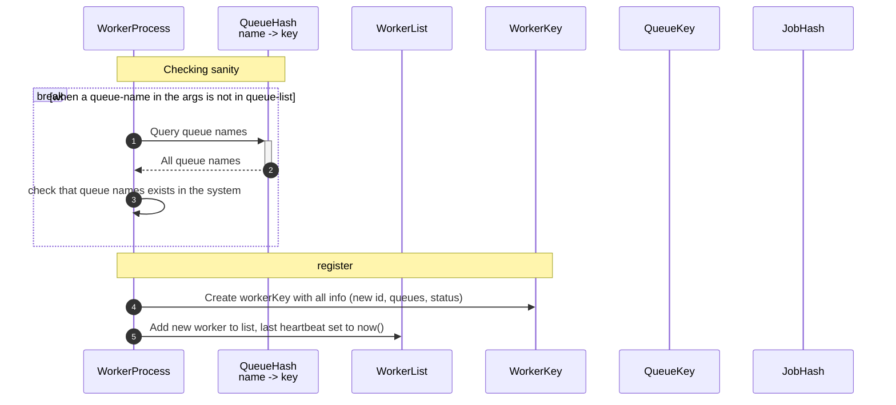
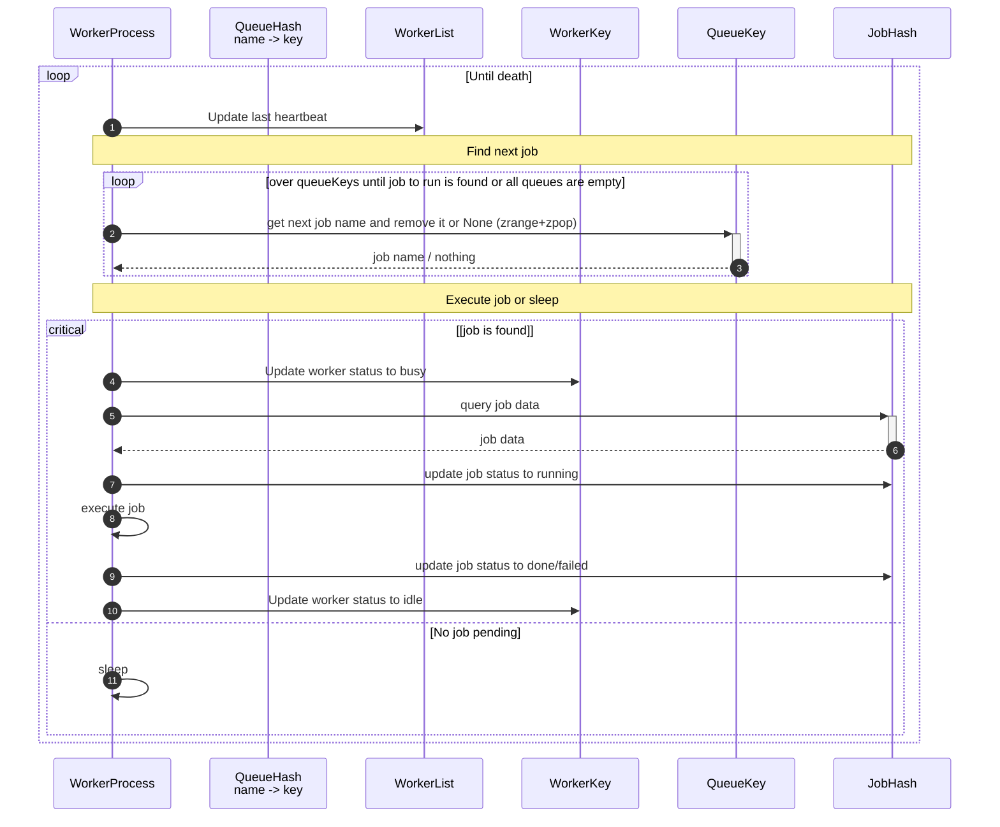

# Worker related flows

Running `python manage.py scheduler_worker --name 'X' --queues high default low`

## Register new worker for queues

```mermaid
sequenceDiagram
    autonumber
    
        participant worker as WorkerProcess
    
        participant qlist as QueueHash<br/>name -> key 
        participant wlist as WorkerList
        participant wkey as WorkerKey
        participant queue as QueueKey
        participant job as JobHash
    
    
    note over worker,qlist: Checking sanity

    break when a queue-name in the args is not in queue-list
        worker ->>+ qlist: Query queue names
        qlist -->>- worker: All queue names
        worker ->> worker: check that queue names exists in the system
    end
    
    note over worker,wkey: register
    worker ->> wkey: Create workerKey with all info (new id, queues, status)
    worker ->> wlist: Add new worker to list, last heartbeat set to now()
```

## Work (execute jobs on queues)

```mermaid
sequenceDiagram
    autonumber
    
        participant worker as WorkerProcess
    
        participant qlist as QueueHash<br/>name -> key 
        participant wlist as WorkerList
        participant wkey as WorkerKey
        participant queue as QueueKey
        participant job as JobHash
    
    loop Until death
        worker ->> wlist: Update last heartbeat
        note over worker,job: Find next job
       
        loop over queueKeys until job to run is found or all queues are empty
            worker ->>+ queue: get next job name and remove it or None (zrange+zpop)
            queue -->>- worker: job name / nothing
        end
        
        note over worker,job: Execute job or sleep
        critical [job is found]
            worker ->> wkey: Update worker status to busy
            worker ->>+ job: query job data
            job -->>- worker: job data
    
            worker ->> job: update job status to running
            worker ->> worker: execute job
            worker ->> job: update job status to done/failed
            worker ->> wkey: Update worker status to idle
        option No job pending
            worker ->> worker: sleep    
        end  
    end
```

# Scheduler flows
