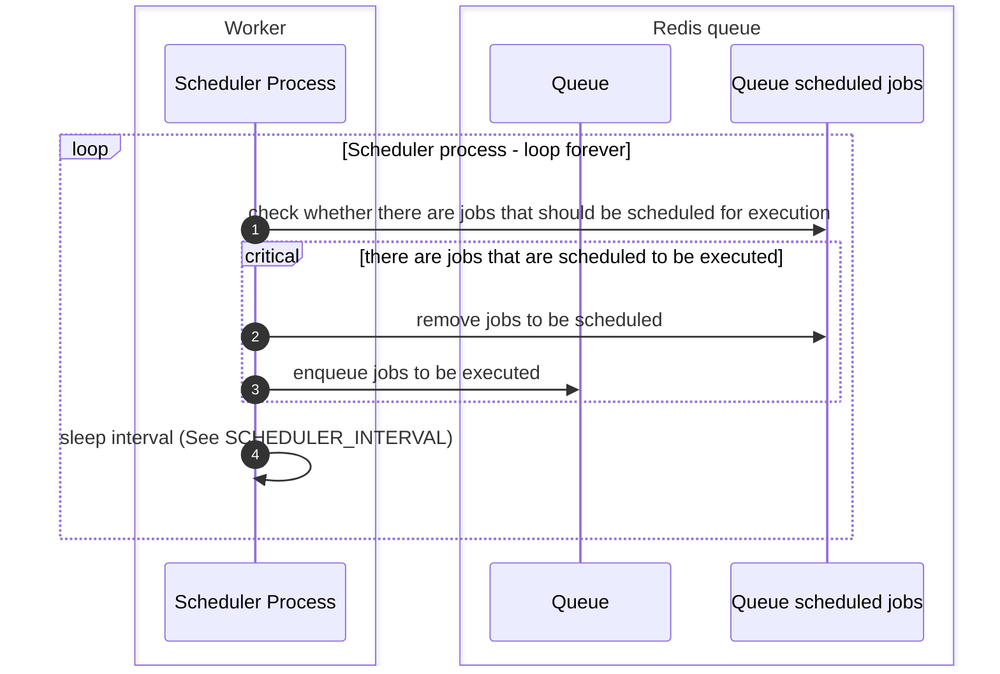
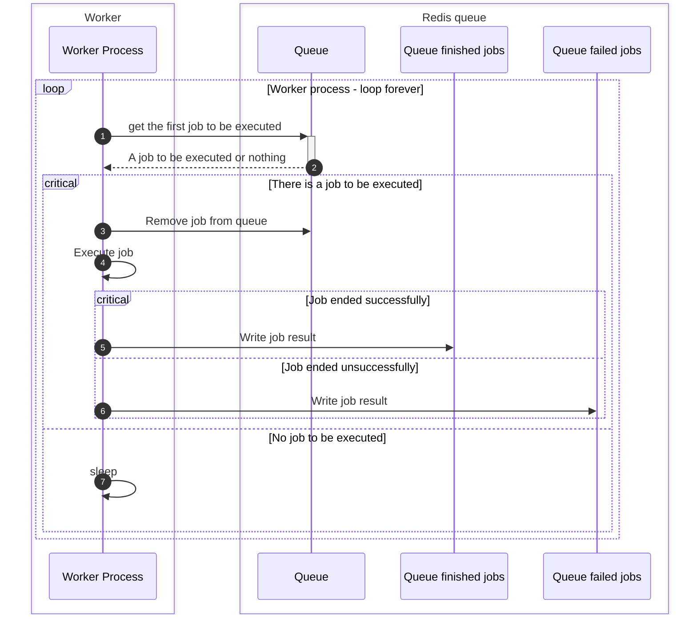

# Django RQ Scheduler

---

A database backed job scheduler for Django RQ.
This allows remembering scheduled jobs, their parameters, etc.

!!! Info

    Starting v2023.5.0, django-tasks-scheduler does not require django-rq to run. 
    Most features from django-rq are now implemented on this package.

    It is recommended you use the import/export management commands to
    save your database.

## Terminology

### Queue

A queue of messages between processes (main django-app process and worker usually).
This is implemented in `rq` package.

* A queue contains multiple registries for scheduled jobs, finished jobs, failed jobs, etc.

### Worker

A process listening to one or more queues **for jobs to be executed**, and executing jobs queued to be
executed.

### Scheduler

A process listening to one or more queues for **jobs to be scheduled for execution**, and schedule them
to be executed by a worker.

This is a sub-process of worker.

### Queued Job Execution

Once a worker listening to the queue becomes available,
the job will be executed

### Scheduled Job Execution

A scheduler checking the queue periodically will check
whether the time the job should be executed has come, and if so, it will queue it.

* A job is considered scheduled if it is queued to be executed, or scheduled to be executed.
* If there is no scheduler, the job will not be queued to run.

### Scheduled Job

django models storing information about jobs. So it is possible to schedule using
django-admin and track their status.

There are 3 types of scheduled job.

* `Scheduled Job` - Run a job once, on a specific time (can be immediate).
* `Repeatable Job` - Run a job multiple times (limited number of times or infinite times) based on an interval
* `Cron Job` - Run a job multiple times (limited number of times or infinite times) based on a cron string

Scheduled jobs are scheduled when the django application starts, and after a scheduled job is executed.

## Scheduler sequence diagram

## Worker sequence diagram

---

## Reporting issues or Features requests

Please report issues via [GitHub Issues](https://github.com/dsoftwareinc/django-tasks-scheduler/issues) .

---

## Acknowledgements

Based on original [django-tasks-scheduler](https://github.com/isl-x/django-tasks-scheduler) - Now supports Django 4.0.

A lot of django-admin views and their tests were adopted from [django-rq](https://github.com/rq/django-rq).
