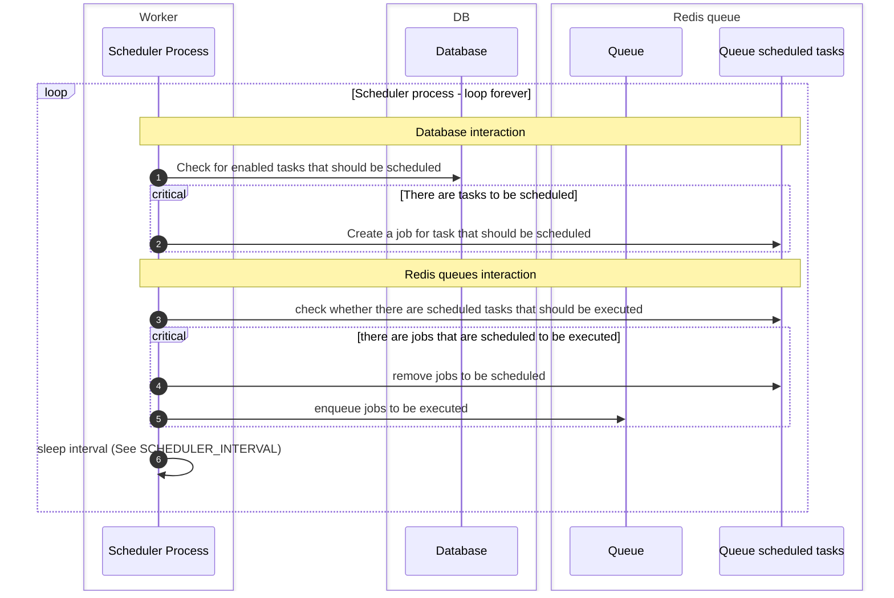
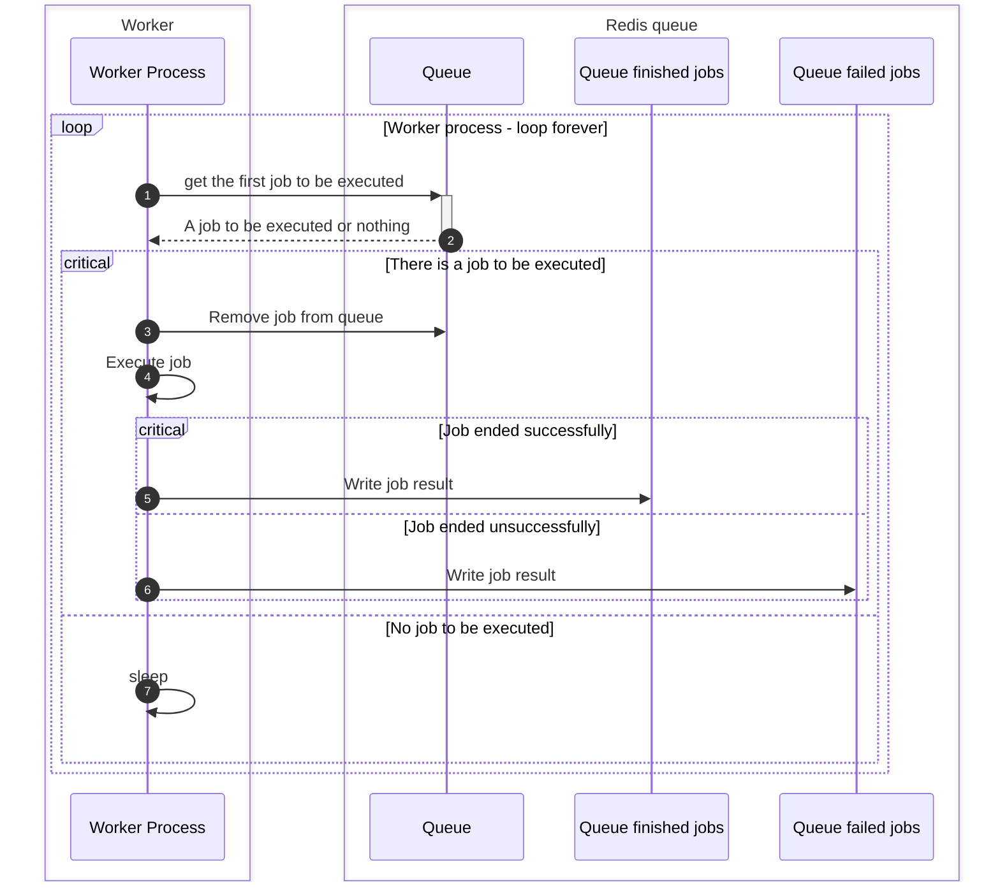

# Django tasks Scheduler

[![Django CI][badge]][2]
![badge][coverage]
[![badge][pypi-downloads]][pypi]

---

A database backed asynchronous tasks scheduler for django.
This allows remembering scheduled tasks, their parameters, etc.

!!! Important
    Version 3.0.0 introduced a major design change. Instead of three separate models, there is one new `Task` model.
    The goal is to simplify.
    Make sure to follow [the migration guide](migrate_to_v3.md)

## Terminology

### Scheduled Task

Starting v3.0.0, django-tasks-scheduler is using a single `Task` model with different task types, the task types are:

- `ONCE` - Run the task once at a scheduled time.
- `REPEATABLE` - Run the task multiple times (limited number of times or infinite times) based on a time interval.
- `CRON` - Run a task indefinitely based on a cron string schedule.

This enables having one admin view for all scheduled tasks, and having one table in the database to maintain the task
reduces the number of overall queries.
An `Task` instance contains all relevant information about a task to enable the users to schedule using django-admin and
track their status.

Previously, there were three different models for ScheduledTask. These exist for legacy purposes and are scheduled to
be removed.

* `Scheduled Task` - Run a task once, on a specific time (can be immediate).
* `Repeatable Task` - Run a task multiple times (limited number of times or infinite times) based on an interval
* `Cron Task` - Run a task multiple times (limited number of times or infinite times) based on a cron string

Scheduled tasks are scheduled when the django application starts, and after a scheduled task is executed.

### Queue

A queue of messages between processes (main django-app process and worker usually).
This is implemented in `rq` package.

* A queue contains multiple registries for scheduled tasks, finished jobs, failed jobs, etc.

### Worker

A process listening to one or more queues **for jobs to be executed**, and executing jobs queued to be
executed.

### Scheduler

A process listening to one or more queues for **jobs to be scheduled for execution**, and schedule them
to be executed by a worker.

This is a subprocess of worker.

### Queued Job Execution

Once a worker listening to the queue becomes available, the job will be executed

### Scheduled Job Execution

A scheduler checking the queue periodically will check whether the time the job should be executed has come, and if so,
it will queue it.

* A job is considered scheduled if it is queued to be executed, or scheduled to be executed.
* If there is no scheduler, the job will not be queued to run.

## Scheduler sequence diagram

## Worker sequence diagram

---

## Reporting issues or Features requests

Please report issues via [GitHub Issues][issues] .

---

## Acknowledgements

A lot of django-admin views and their tests were adopted from [django-rq][django-rq].

[badge]:https://github.com/django-commons/django-tasks-scheduler/actions/workflows/test.yml/badge.svg

[2]:https://github.com/django-commons/django-tasks-scheduler/actions/workflows/test.yml

[coverage]:https://img.shields.io/endpoint?url=https://gist.githubusercontent.com/cunla/b756396efb895f0e34558c980f1ca0c7/raw/django-tasks-scheduler-4.json

[pypi-downloads]:https://img.shields.io/pypi/dm/django-tasks-scheduler

[pypi]:https://pypi.org/project/django-tasks-scheduler/

[issues]:https://github.com/django-commons/django-tasks-scheduler/issues

[django-rq]:https://github.com/rq/django-rq