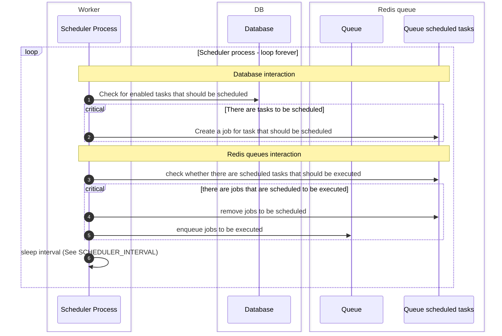
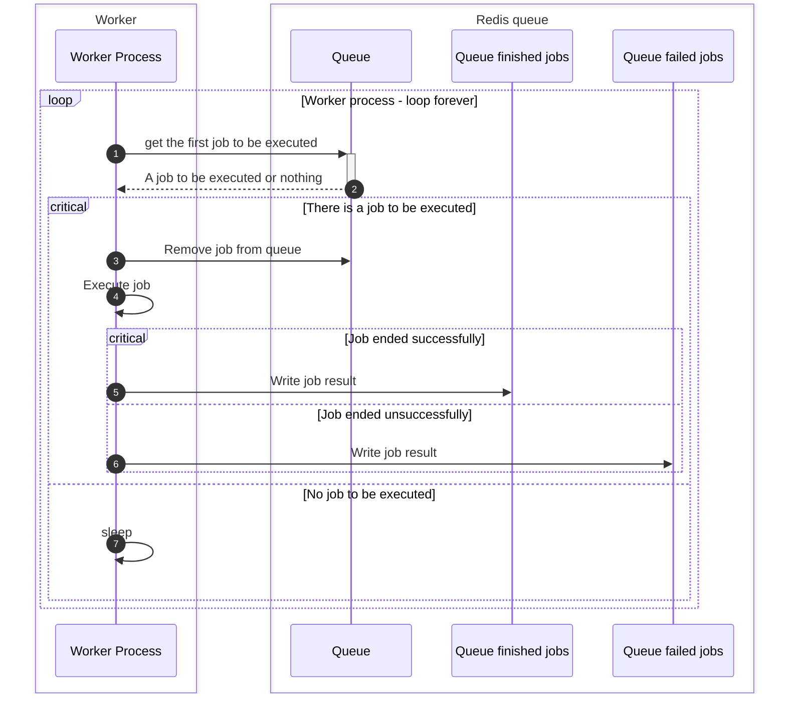

# Django tasks Scheduler

---

A database backed async tasks scheduler for django.
This allows remembering scheduled tasks, their parameters, etc.

## Terminology

### Queue

A queue of messages between processes (main django-app process and worker usually).
This is implemented in `rq` package.

* A queue contains multiple registries for scheduled tasks, finished jobs, failed jobs, etc.

### Worker

A process listening to one or more queues **for jobs to be executed**, and executing jobs queued to be
executed.

### Scheduler

A process listening to one or more queues for **jobs to be scheduled for execution**, and schedule them
to be executed by a worker.

This is a subprocess of worker.

### Queued Job Execution

Once a worker listening to the queue becomes available, the job will be executed

### Scheduled Task Execution

A scheduler checking the queue periodically will check whether the time the job should be executed has come, and if so,
it will queue it.

* A job is considered scheduled if it is queued to be executed, or scheduled to be executed.
* If there is no scheduler, the job will not be queued to run.

### Scheduled Task

django models storing information about jobs. So it is possible to schedule using
django-admin and track their status.

There are three types of ScheduledTask.

* `Scheduled Task` - Run a job once, on a specific time (can be immediate).
* `Repeatable Task` - Run a job multiple times (limited number of times or infinite times) based on an interval
* `Cron Task` - Run a job multiple times (limited number of times or infinite times) based on a cron string

Scheduled jobs are scheduled when the django application starts, and after a scheduled task is executed.

## Scheduler sequence diagram

## Worker sequence diagram

---

## Reporting issues or Features requests

Please report issues via [GitHub Issues](https://github.com/dsoftwareinc/django-tasks-scheduler/issues) .

---

## Acknowledgements

A lot of django-admin views and their tests were adopted from [django-rq](https://github.com/rq/django-rq).
