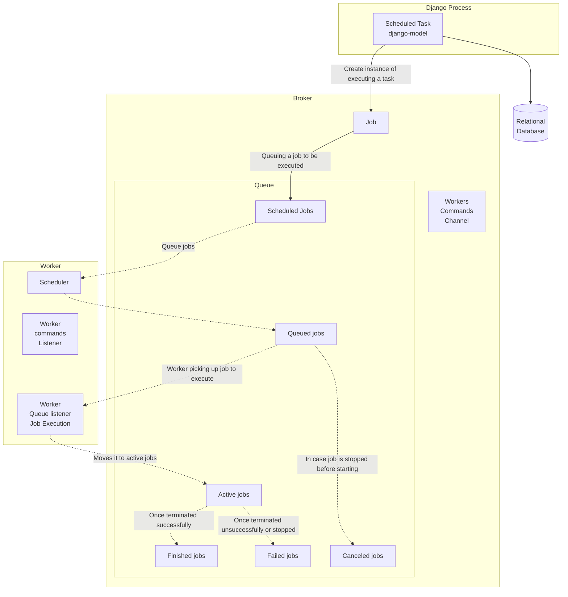
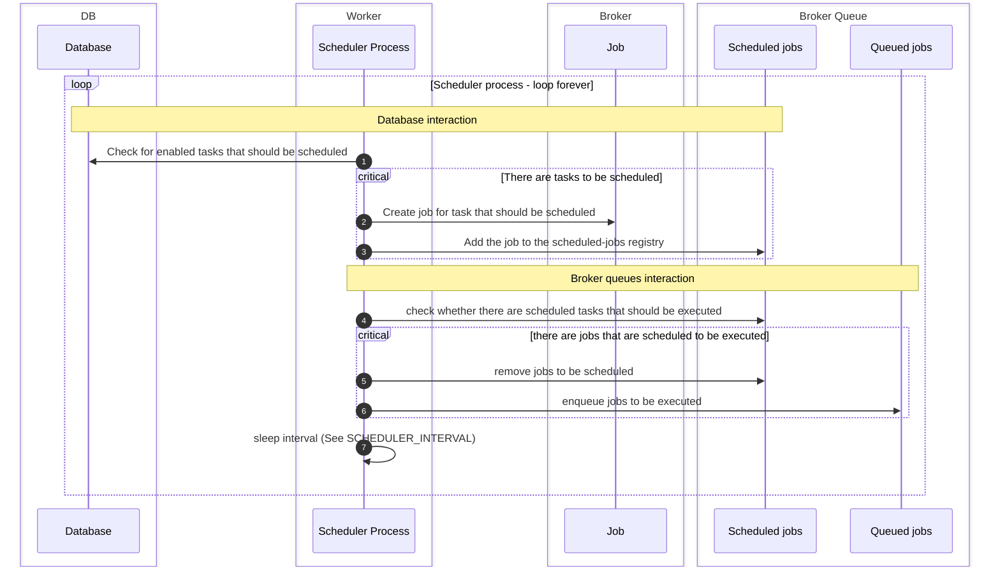
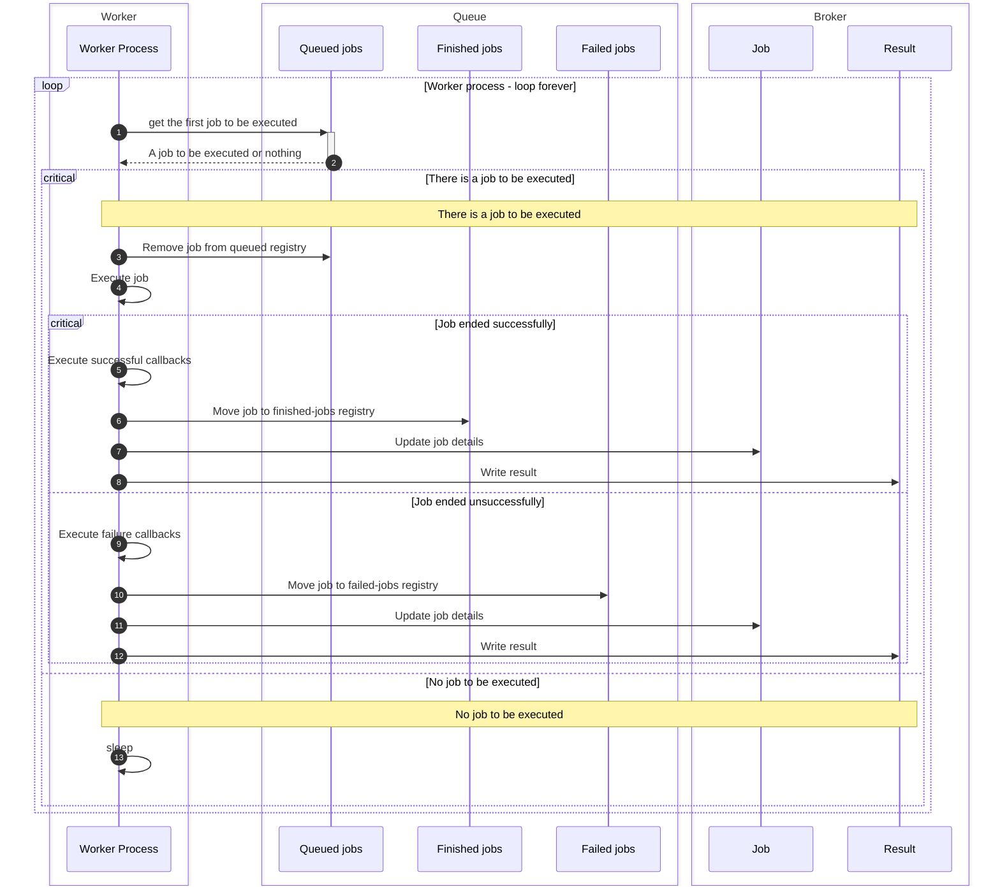

# Django tasks Scheduler

[![Django CI][badge]][2]
![badge][coverage]

---

A database backed asynchronous tasks scheduler for django.
This allows remembering scheduled tasks, their parameters, etc.

!!! Important
    Version 3.0.0 introduced a major design change. Instead of three separate models, there is one new `Task` model.
    The goal is to simplify.
    Make sure to follow [the migration guide](migrate_to_v3.md)

## Architecture and terminology

### Scheduled Task

django-tasks-scheduler is using a single `Task` django-model with different task types, the task types
are:

- `ONCE` - Run the task once at a scheduled time.
- `REPEATABLE` - Run the task multiple times (limited number of times or infinite times) based on a time interval.
- `CRON` - Run a task indefinitely based on a cron string schedule.

This enables having one admin view for all scheduled tasks, and having one table in the database to maintain the task
reduces the number of overall queries.
An `Task` instance contains all relevant information about a task to enable the users to schedule using django-admin and
track their status.

### Job

A job is a record in the broker, containing all information required to execute a piece of code, usually representing a
task, but not necessarily.

It contains the following information:

- Name of the job (that is unique, and passed in different queues).
- Link to the task.
- Reference to the method to be executed.
- Callbacks (In case of failure/success/stopped).
- Timeout details (for method to be executed, for callbacks)
- Successful/Failed result time-to-live.

### Queue

A queue of messages between processes (main django-app process and worker usually).
It is a collection of different registries for different purposes:

- Scheduled jobs: Jobs that are scheduled to run
- Queued jobs: Jobs waiting to be picked up by a worker to run.
- Active jobs: Jobs that are currently being executed.
- Finished jobs: Jobs that have been successfully executed
- Failed jobs: Jobs that have failed to execute or have been stopped
- Canceled jobs: Jobs that have been stopped/canceled before they were executed

### Worker

A process listening to one or more queues **for jobs to be executed**, and executing jobs queued to be executed.

- A worker has a thread listening to a channel where it can get specific commands.
- A worker can have, by default, a subprocess for the scheduler.

### Scheduler (Worker sub-process)

A process listening to one or more queues for **jobs to be scheduled for execution**, and schedule them to be executed
by a worker (i.e., move them from scheduled-jobs registry to queued-jobs registry).

This is a sub-process of worker.

### Job

Once a worker listening to the queue becomes available, the job will be executed.

A scheduler checking the queue periodically will check whether the time the job should be executed has come, and if so,
it will queue it, i.e., add it to the queued-jobs registry.

* A job is considered scheduled if it is queued to be executed, or scheduled to be executed.
* If there is no scheduler, the job will not be queued to run.

## Scheduler sequence diagram

## Worker sequence diagram

---

## Reporting issues or Features requests

Please report issues via [GitHub Issues][issues] .

---

## Acknowledgements

- Some django-admin views and their tests were adopted from [django-rq][django-rq].
- Worker and Queue implementation was inspired by [rq][rq].

[badge]:https://github.com/django-commons/django-tasks-scheduler/actions/workflows/test.yml/badge.svg

[2]:https://github.com/django-commons/django-tasks-scheduler/actions/workflows/test.yml

[coverage]:https://img.shields.io/endpoint?url=https://gist.githubusercontent.com/cunla/b756396efb895f0e34558c980f1ca0c7/raw/django-tasks-scheduler-4.json

[pypi-downloads]:https://img.shields.io/pypi/dm/django-tasks-scheduler

[pypi]:https://pypi.org/project/django-tasks-scheduler/

[issues]:https://github.com/django-commons/django-tasks-scheduler/issues

[django-rq]:https://github.com/rq/django-rq

[rq]:https://github.com/rq/rq