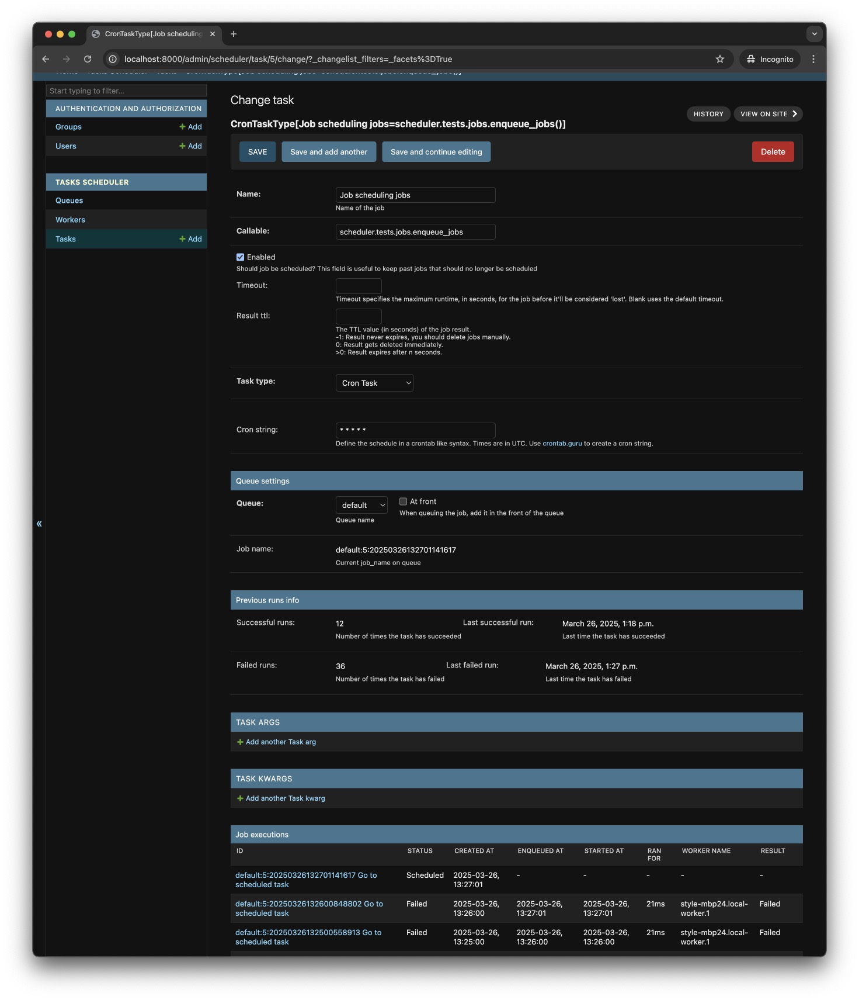
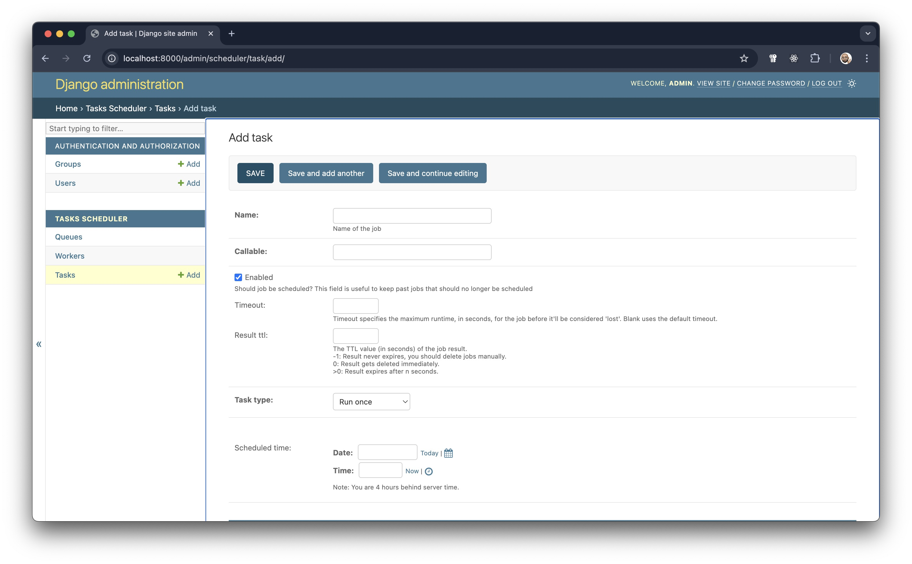
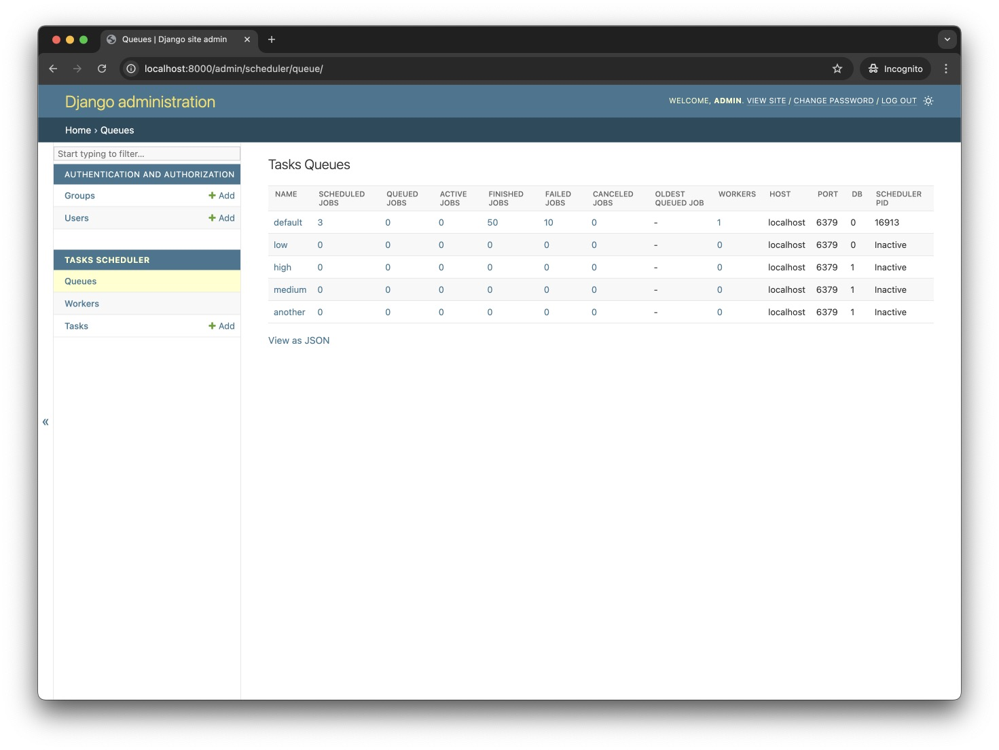
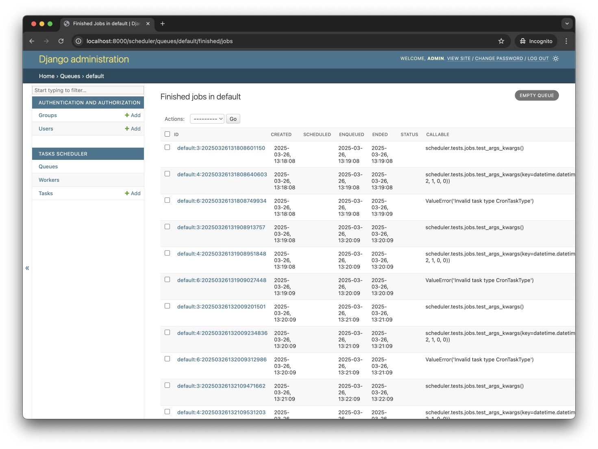
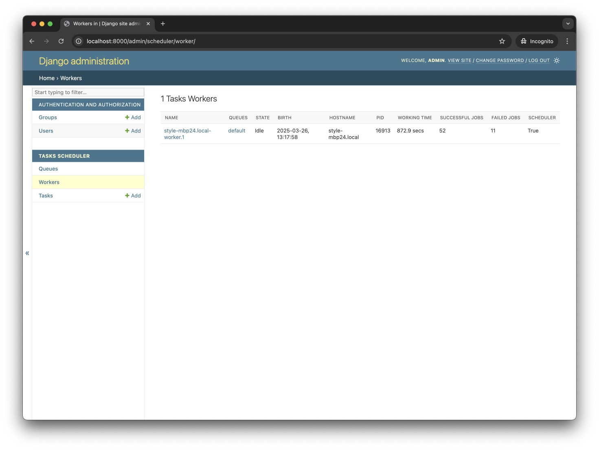
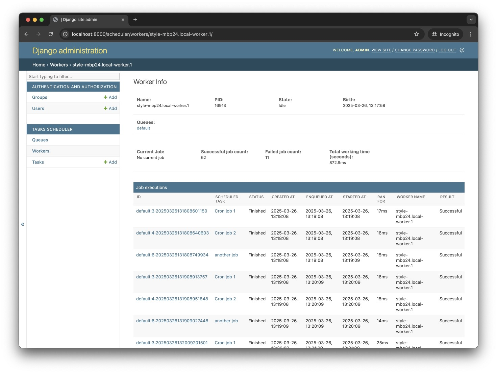

# Usage

## Enqueue jobs from code

```python
from scheduler import job


@job()
def long_running_func():
    pass


long_running_func.delay()  # Enqueue function in "default" queue
```

Specifying the queue where the job should be queued:

```python
@job('high')
def long_running_func():
    pass


long_running_func.delay()  # Enqueue function in "high" queue
```

You can pass in any arguments that RQ's job decorator accepts:

```python
from scheduler import job


@job('default', timeout=3600)
def long_running_func():
    pass


long_running_func.delay()  # Enqueue function with a timeout of 3600 seconds.
```

You can set in `settings.py` a default value for `DEFAULT_JOB_TTL` and `DEFAULT_JOB_TIMEOUT`.

```python
# settings.py
SCHEDULER_CONFIG = SchedulerConfiguration(
    DEFAULT_SUCCESS_TTL=10 * 60,  # Time To Live (TTL) in seconds to keep successful job results
    DEFAULT_FAILURE_TTL=365 * 24 * 60 * 60,  # Time To Live (TTL) in seconds to keep job failure information
    DEFAULT_JOB_TTL=10 * 60,  # Time To Live (TTL) in seconds to keep job information
    DEFAULT_JOB_TIMEOUT=5 * 60,  # timeout (seconds) for a job
)
```

## Managing tasks through the Django Admin

### Viewing list of scheduled tasks


### Viewing details of a scheduled task

It is possible to view list of executions of a task, as well as the details of a specific execution.


### Scheduling a task Through django-admin

* Sign in to the Django Admin site (e.g., http://localhost:8000/admin/) and locate the `Tasks Scheduler` section.
* Click on the **Add**  on `Tasks`
* Enter a unique name for the task in the **Name** field.
* Select the task type, and according to the type, the form will change for the scheduling details.
    * For `Repeatable task`
        * Enter an Interval, and choose the Interval unit. This will calculate the time before the function is called
          again.
        * In the Repeat field, enter the number of times the job is to be run. Leaving the field empty, means the job
          will be scheduled to run forever.
    * For `Cron task`
        * In the Repeat field, enter the number of times the job is to be run. Leaving the field empty, means the job
          will be scheduled to run forever.
        * In the cron string field, enter a cron string describing how often the job should run.
* In the **Callable** field, enter a Python dot notation path to the method that defines the job. For the example  
  above, that would be `myapp.jobs.count`
* Choose your **Queue**.
  The queues listed are defined in your app `settings.py` under `SCHEDULER_QUEUES`.
* Enter the time in UTC the job is to be executed in the **Scheduled time** field.



#### Optional fields:

* Select whether the job should take priority over existing queued jobs when it is queued (jobs waiting to be executed)
  by using **at front**.
* **Timeout** specifies the maximum time in seconds the job is allowed to run. blank value means it can run forever.
* **Result TTL** (Time to live): The time to live value (in seconds) of the job result.
    - `-1`: Result never expires, you should delete jobs manually.
    - `0`: Result gets deleted immediately.
    - `n` (where `n > 0`) : Result expires after n seconds.

Once you are done, click **Save** and your job will be persisted to django database.

#### Support for arguments for tasks

django-tasks-scheduler supports scheduling tasks calling methods with arguments, as well as arguments that should be
calculated in runtime.


### Viewing queue statistics



### Viewing queue specific registry jobs



### Viewing workers list



### Viewing worker details



## Enqueue jobs using the command line

It is possible to queue a job to be executed from the command line
using django management command:

```shell
python manage.py run_job -q {queue} -t {timeout} -r {result_ttl} {callable} {args}
```

## Running a worker to process queued jobs in the background

Create a worker to execute queued jobs on specific queues using:

```shell
usage: manage.py scheduler_worker [-h] [--pid PIDFILE] [--name NAME] [--worker-ttl WORKER_TTL] [--fork-job-execution FORK_JOB_EXECUTION] [--sentry-dsn SENTRY_DSN] [--sentry-debug] [--sentry-ca-certs SENTRY_CA_CERTS] [--burst]
                                  [--max-jobs MAX_JOBS] [--max-idle-time MAX_IDLE_TIME] [--with-scheduler] [--version] [-v {0,1,2,3}] [--settings SETTINGS] [--pythonpath PYTHONPATH] [--traceback] [--no-color] [--force-color]
                                  [--skip-checks]
                                  [queues ...]
```

More information about the different parameters can be found in the [commands documentation](commands.md).

### Running multiple workers as unix/linux services using systemd

You can have multiple workers running as system services.
To have multiple scheduler workers, edit the `/etc/systemd/system/scheduler_worker@.service`
file, make sure it ends with `@.service`, the following is example:

```ini
# /etc/systemd/system/scheduler_worker@.service
[Unit]
Description = scheduler_worker daemon
After = network.target

[Service]
WorkingDirectory = {{ path_to_your_project_folder } }
ExecStart = /home/ubuntu/.virtualenv/{ { your_virtualenv } }/bin/python \
            {{ path_to_your_project_folder } }/manage.py \
            scheduler_worker high default low
# Optional 
# {{user to run scheduler_worker as}}
User = ubuntu
# {{group to run scheduler_worker as}}
Group = www-data
# Redirect logs to syslog
StandardOutput = syslog
StandardError = syslog
SyslogIdentifier = scheduler_worker
Environment = OBJC_DISABLE_INITIALIZE_FORK_SAFETY = YES
Environment = LC_ALL = en_US.UTF-8
Environment = LANG = en_US.UTF-8

[Install]
WantedBy = multi-user.target
```

After you are done editing the file, reload the settings and start the new workers:

```shell
sudo systemctl daemon-reload
sudo systemctl start scheduler_worker@{1..3} 
```

You can target a specific worker using its number:

```shell
sudo systemctl stop scheduler_worker@2
```